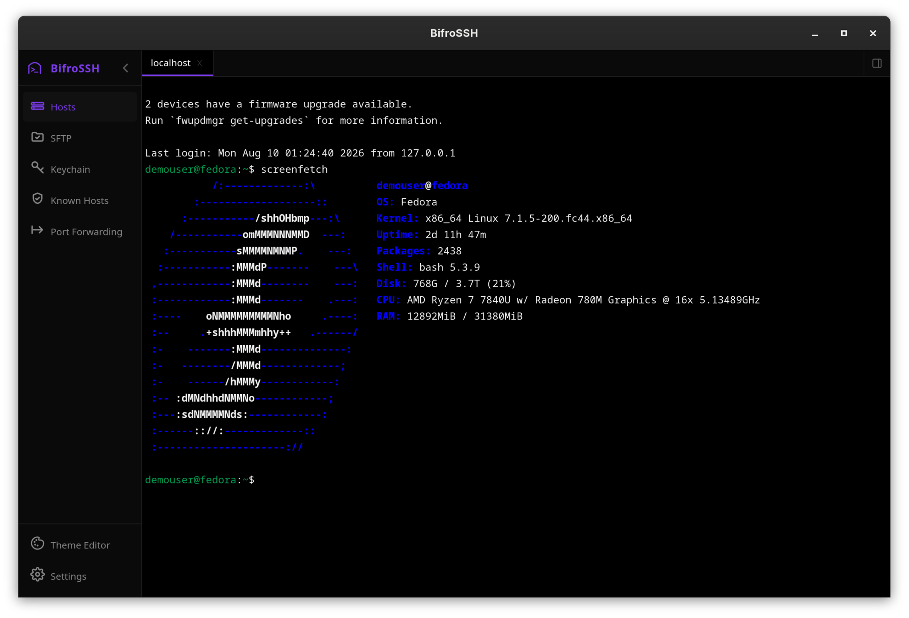
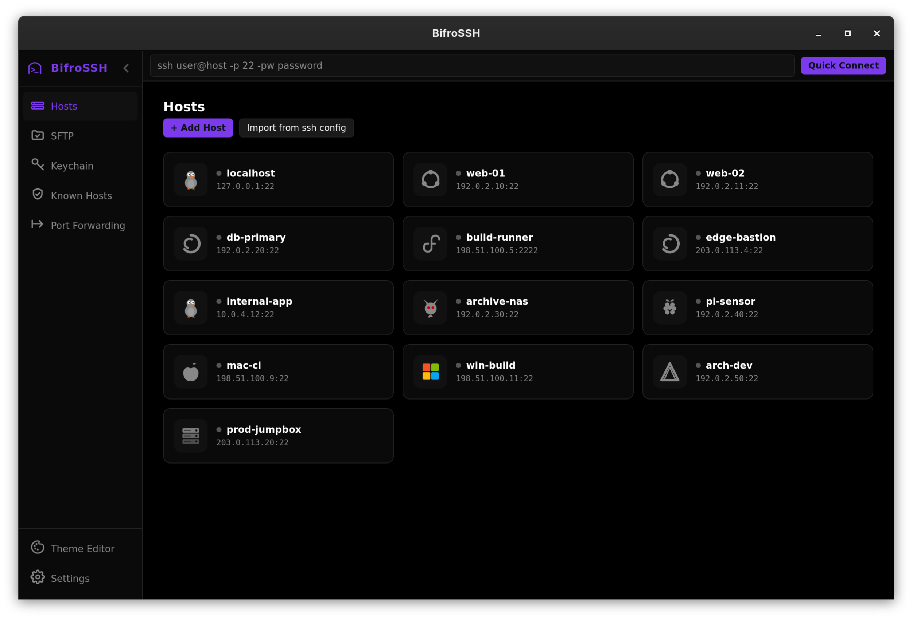
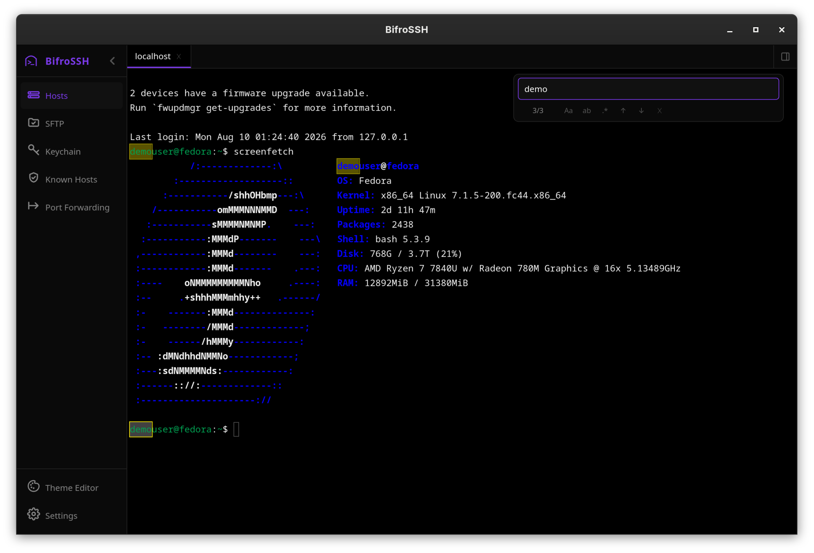
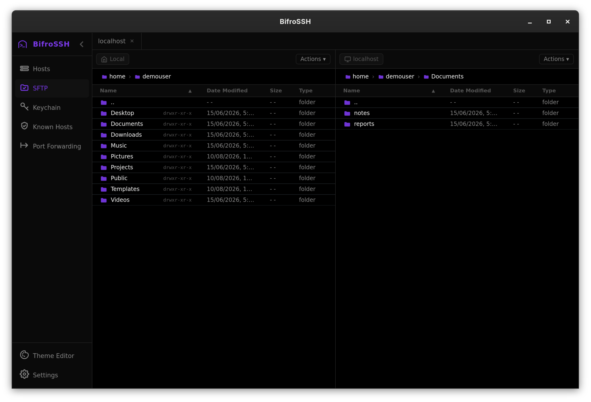
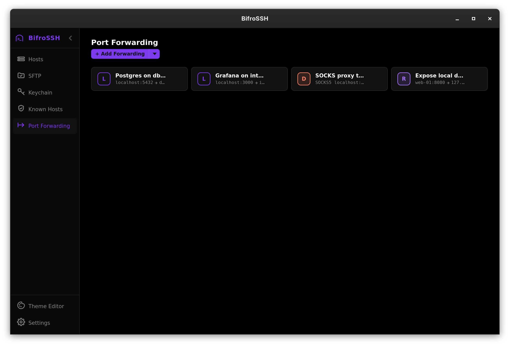
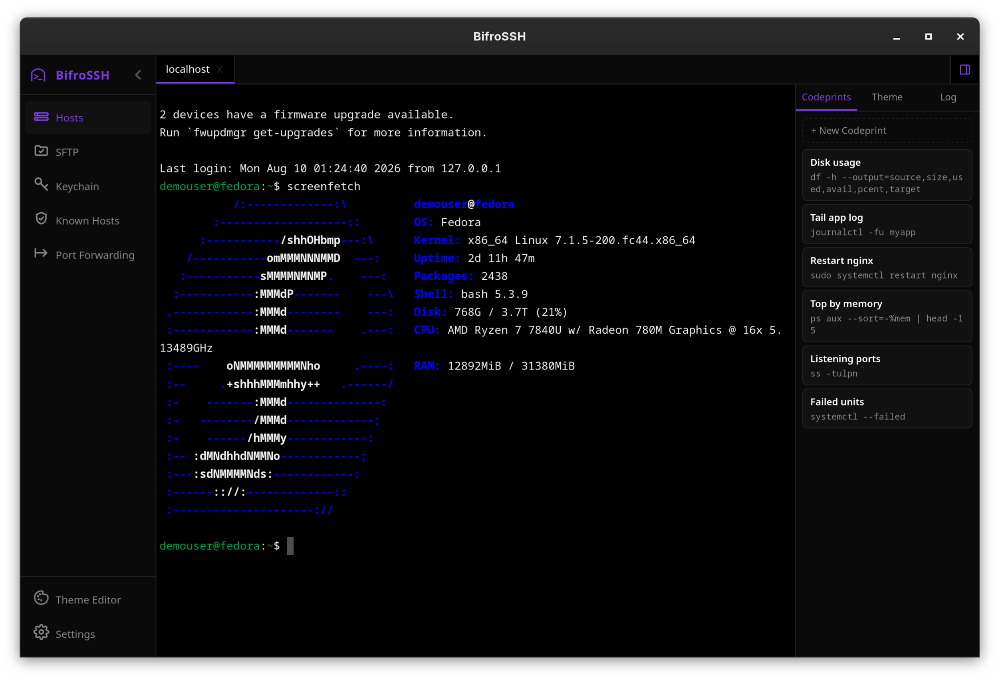
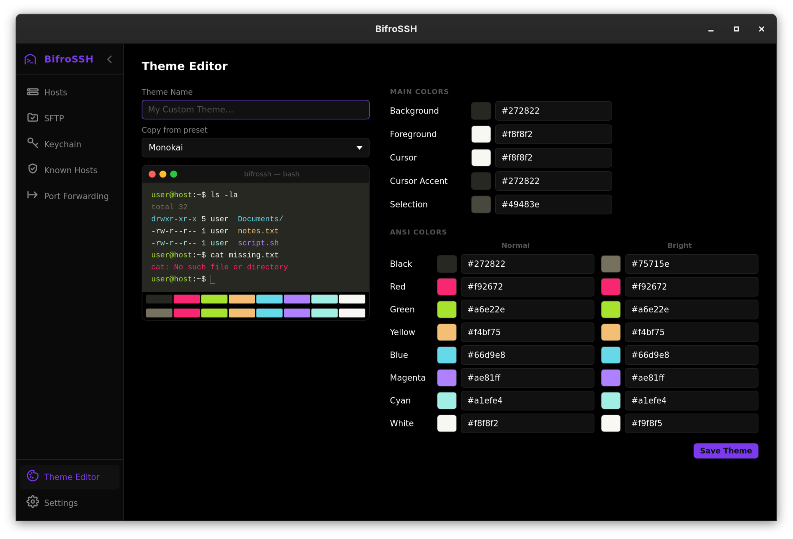
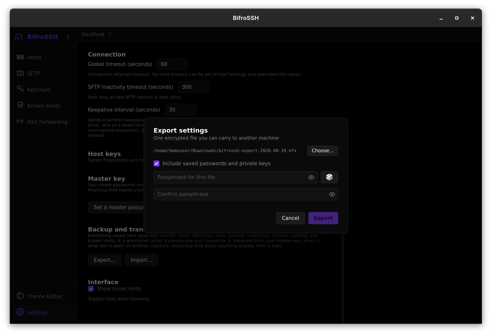
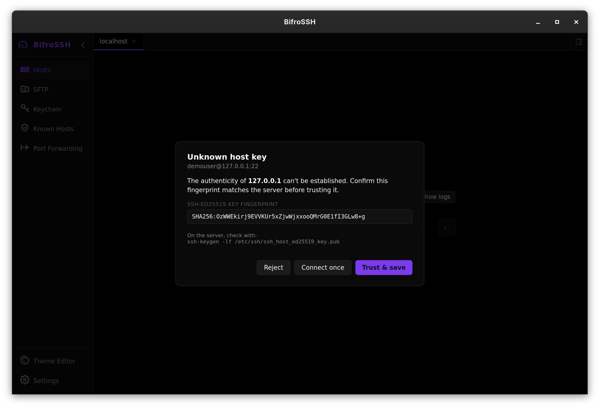

# BifroSSH

A GUI SSH client for Linux. Terminal, SFTP, port forwarding and key management in one window, with your hosts and credentials encrypted at rest.

Built with Tauri 2, React and Rust. Distributed as a Flatpak; ssh-agent and desktop keyring integration are Unix-specific and no other platform is currently supported.



## Install

No Rust, Node.js or build tools needed.

```bash
flatpak remote-add --if-not-exists flathub https://flathub.org/repo/flathub.flatpakrepo
flatpak remote-add bifrossh https://aalmansadath.github.io/BifroSSH/bifrossh.flatpakrepo
flatpak install bifrossh io.github.aalmansadath.bifrossh
flatpak run io.github.aalmansadath.bifrossh
```

Ubuntu needs a user-mode install to avoid FUSE permission issues, so add `--user` to each command above.

```bash
flatpak update io.github.aalmansadath.bifrossh     # update
flatpak uninstall io.github.aalmansadath.bifrossh  # remove
flatpak remote-delete bifrossh                     # and drop the remote
```

## Features

**Hosts.** Import straight from `~/.ssh/config` or add them by hand. Per-host username, key or password, port, OS tag and default theme, or shared identities reused across servers. Quick-connect from the sidebar.



**Jump hosts.** Reach a server through a bastion, the same as ssh's `ProxyJump`, chained as deep as you need. Each hop authenticates with its own credentials and has its own host key verified, so a bastion on an agent key and a target on a password work together unchanged. Terminal, SFTP and tunnels all follow the chain.

**Terminal.** xterm.js with 10 000 lines of scrollback, configurable font and cursor, and per-session colours. **Ctrl+Shift+F** searches the scrollback with match highlighting, case, whole-word and regex options. Any number of sessions in tabs, each independent.



**SFTP.** Browse, upload, download, rename and delete, including whole folders in either direction or directly between two remote servers, with per-file progress.



**SSH keys.** Generate Ed25519, RSA and ECDSA keys in the app, or import existing ones. Private keys are stored encrypted and never written to disk in the clear.

**ssh-agent.** Authenticate with keys held by a running agent instead of importing them, so the key never enters the app. This is how to use PIV smartcards and YubiKeys, whose keys cannot be exported. FIDO keys (`ed25519-sk`, `ecdsa-sk`) are not supported yet.

**Two-factor and keyboard-interactive.** Servers that ask challenge questions at login work, including PAM setups with `PasswordAuthentication` off and providers like Duo and TOTP apps. Where the server offers a choice of factors they appear as buttons. Password and key logins fall back to this automatically.

**Port forwarding.** Local (`-L`), remote (`-R`) and dynamic SOCKS5 (`-D`) tunnels, created with a wizard and started from a card. Several can run at once.



**Codeprints.** Named commands you keep around, pasted into the prompt to edit or run outright, shared across every session.



**Themes.** Dark and light out of the box, plus an editor for every colour including all 16 ANSI slots. Apply a theme to one session without changing the host's default.



**Export and import.** Move a whole setup to another machine, or keep a backup. Writes one encrypted `.bfx` file holding hosts, identities, keys, tunnels, codeprints, themes, settings and known hosts. Importing only ever adds: anything already there is kept and reported as skipped, so the same file can be imported twice safely.



**Connection reliability.** Configurable keepalives stop idle sessions being dropped by NAT and firewall timers, and every connection keeps a log of how it was established, still readable after the fact.

## Security

**Host keys are verified** before authenticating, the same way OpenSSH does. An unknown server shows its fingerprint for you to confirm; a server presenting a different key than the one stored is refused, because that is what a man-in-the-middle looks like. Three policies are available for unknown servers, **Ask** (default), **Accept new** and **Strict**, and a mismatch is refused under all three.



Trusted keys live in `~/.local/share/bifrossh/known_hosts` in standard OpenSSH format. Your `~/.ssh/known_hosts` is also read, so anything you have already connected to from a terminal never prompts. That file is only ever read, never modified.

**Everything saved is encrypted** with a single master key. The whole of `data.json` is encrypted rather than just the credentials, so hostnames, usernames, jump chains, forwarding rules and saved commands are not left in the clear either.

On first launch you choose where that master key lives, and can change it later in Settings:

- **Desktop keyring, with a passphrase to fall back on.** Unlocks without asking. The key is not kept on disk, and the passphrase means the keyring going missing cannot lock you out.
- **Passphrase only.** Asked at every launch. The key exists nowhere until you type it. The only option that protects your keys from something already running as your user, and the only one where forgetting the passphrase loses them.
- **A file, no passphrase.** Nothing to remember. The key sits beside your data, readable only by your account.

Settings always shows which of these is actually in use. Where a passphrase is wanted, a dice button generates an eight-word phrase from the [BIP-39](https://github.com/bitcoin/bips/blob/master/bip-0039.mediawiki) English list (88 bits, hashed with Argon2id); capitalisation and spacing are ignored when you type it back. A passphrase you write yourself is taken exactly as typed.

None of this defends against malware running as you while the app is unlocked, and on Linux nothing can. What it buys is that copying your home directory no longer copies the key along with the data.

---

## Build from source

Package names below are Fedora's; adjust for your distro.

### 1. System dependencies (one-time)

```bash
sudo dnf install -y webkit2gtk4.1-devel javascriptcoregtk4.1-devel openssl-devel gtk3-devel \
  libappindicator-gtk3-devel librsvg2-devel curl file gcc
```

### 2. Rust (one-time)

```bash
curl --proto '=https' --tlsv1.2 -sSf https://sh.rustup.rs | sh
source "$HOME/.cargo/env"
```

### 3. Node.js (one-time)

```bash
sudo dnf install -y nodejs npm
```

### 4. Clone and install

```bash
git clone https://github.com/AalmanSadath/BifroSSH.git
cd BifroSSH
npm install
./install.sh
```

### install.sh commands

| Command | Action |
|---|---|
| `./install.sh` | Build and install as native desktop app |
| `./install.sh uninstall` | Remove native desktop app |
| `./install.sh flatpak` | Build and install as Flatpak |
| `./install.sh uninstall-flatpak` | Remove Flatpak and local repo |
| `./install.sh clean` | Delete build artefacts (`dist/`, `src-tauri/target/`, `flatpak/.build/`, `flatpak/.repo/`) without touching the installed app |

---

## Build the Flatpak from source

### One-time setup

```bash
sudo dnf install flatpak-builder
flatpak install flathub org.gnome.Platform//50 org.gnome.Sdk//50
flatpak install flathub org.freedesktop.Sdk.Extension.rust-stable//25.08
flatpak install flathub org.freedesktop.Sdk.Extension.node22//25.08
```

### Build and install

```bash
./install.sh flatpak
flatpak run io.github.aalmansadath.bifrossh
```

The build runs entirely inside the sandbox with no network, so npm dependencies come from `flatpak/node-sources.json` and Cargo dependencies from `flatpak/cargo-sources.json`. Remove it again with `./install.sh uninstall-flatpak`.

---

## Development

```bash
npm install
npm run tauri dev
```

## License

[GPL-3.0-or-later](LICENSE): free to use, modify, and distribute; derivatives must also be open source under GPL-3.0 or later.
